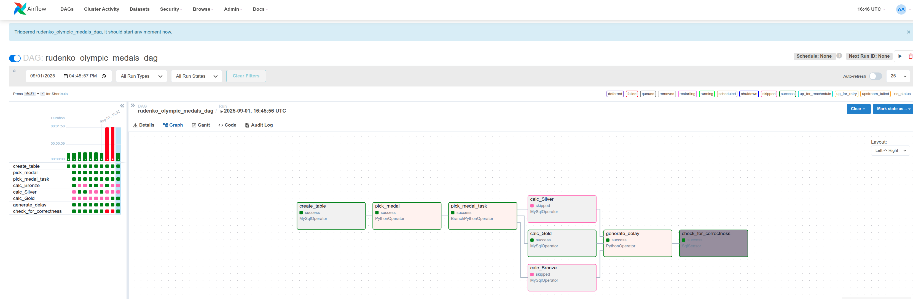
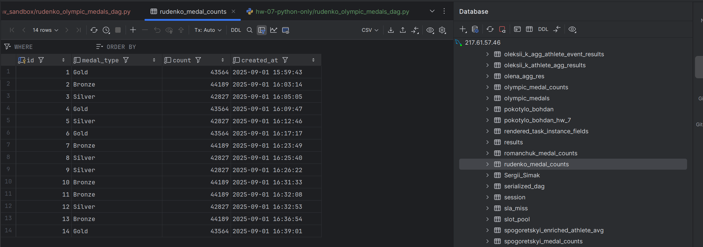

# Домашнє завдання №7: Apache Airflow

**Тема:** Apache Airflow - Orchestration та автоматизація процесів обробки даних

## 📋 Опис завдання

Реалізовано DAG в Apache Airflow, який виконує наступні завдання:
1. Створення таблиці для збереження результатів підрахунку медалей
2. Випадковий вибір типу медалі (Bronze, Silver, Gold)
3. Розгалуження виконання залежно від обраного типу
4. Підрахунок кількості медалей обраного типу з Olympic Dataset
5. Затримка виконання для тестування
6. Перевірка актуальності даних через SQL Sensor

## 🔧 Технічна реалізація

### Структура DAG

```python
DAG: rudenko_olympic_medals_dag
├── create_table (MySqlOperator)
├── pick_medal (PythonOperator)
├── pick_medal_task (BranchPythonOperator)
├── calc_Bronze / calc_Silver / calc_Gold (MySqlOperator)
├── generate_delay (PythonOperator)
└── check_for_correctness (SqlSensor)
```

### Основні компоненти

#### 1. Створення таблиці
```sql
CREATE TABLE IF NOT EXISTS olympic_dataset.rudenko_medal_counts (
    id INT AUTO_INCREMENT PRIMARY KEY,
    medal_type VARCHAR(10) NOT NULL,
    count INT NOT NULL,
    created_at TIMESTAMP NOT NULL DEFAULT CURRENT_TIMESTAMP
)
```

#### 2. Випадковий вибір медалі
Функція `pick_medal()` випадково обирає один з трьох типів медалей:
- Bronze
- Silver  
- Gold

#### 3. Розгалуження (Branching)
`BranchPythonOperator` направляє виконання до відповідної гілки підрахунку медалей на основі випадкового вибору.

#### 4. Підрахунок медалей
Три окремі завдання для підрахунку кількості медалей кожного типу:
```sql
INSERT INTO olympic_dataset.rudenko_medal_counts (medal_type, count, created_at)
SELECT 'Bronze', COUNT(*), NOW()
FROM olympic_dataset.athlete_event_results
WHERE medal = 'Bronze';
```

#### 5. Затримка виконання
Реалізовано два режими:
- **Тестовий режим:** 35 секунд (для демонстрації провалу сенсора)
- **Продуктивний режим:** 10 секунд (для успішного виконання)

#### 6. SQL Sensor
Перевіряє, чи найновіший запис у таблиці не старший за 30 секунд:
```sql
SELECT CASE 
    WHEN TIMESTAMPDIFF(SECOND, MAX(created_at), NOW()) <= 30
    THEN 1 ELSE 0 
END AS is_recent
FROM olympic_dataset.rudenko_medal_counts;
```

## 📊 Результати виконання

### Виконання DAG в Airflow


На скріншоті видно:
- ✅ Успішне створення таблиці
- ✅ Випадковий вибір медалі
- ✅ Розгалуження та виконання відповідної гілки підрахунку
- ✅ Виконання затримки
- 🔴 Провал сенсора при затримці > 30 секунд (тестовий режим)
- ✅ Успішне виконання сенсора при затримці 10 секунд (продуктивний режим)

### Дані в базі даних


Скріншот демонструє записи в таблиці `rudenko_medal_counts`:
- Різні типи медалей (Bronze, Silver, Gold)
- Кількість медалей кожного типу
- Часові мітки створення записів

## 🎯 Ключові досягнення

1. **Динамічне розгалуження:** Реалізовано механізм випадкового вибору та розгалуження виконання DAG
2. **Робота з MySQL:** Використано MySqlOperator для створення таблиць та запису даних
3. **SQL Sensor:** Імплементовано перевірку актуальності даних
4. **Trigger Rules:** Використано `NONE_FAILED_MIN_ONE_SUCCESS` для коректної роботи після розгалуження
5. **Тестування:** Продемонстровано роботу сенсора в різних режимах (успіх/провал)

## 🔐 Конфігурація підключення

```python
Connection ID: goit_mysql_db_rudenko
Host: 217.61.57.46
Schema: olympic_dataset
Login: neo_data_admin
Port: 3306
```

## 📝 Параметри DAG

- **Schedule:** Manual (schedule_interval=None)
- **Catchup:** False
- **Start Date:** 2024-11-26
- **Retries:** 1
- **Retry Delay:** 5 minutes

## 🚀 Запуск та тестування

1. **Тестовий режим (з провалом сенсора):**
   - Встановити `DELAY_SECONDS = 35`
   - Запустити DAG
   - Сенсор провалиться через перевищення 30-секундного ліміту

2. **Продуктивний режим:**
   - Встановити `DELAY_SECONDS = 10`
   - Запустити DAG
   - Всі завдання виконаються успішно

## 📂 Структура файлів

```
hw-07-python-only/
├── rudenko_olympic_medals_dag.py  # Основний DAG файл
├── README.md                       # Документація
├── airflow.png                     # Скріншот виконання DAG
└── db_data.png                     # Скріншот даних в БД
```

## 🔍 Висновки

Завдання успішно виконано. Реалізовано повнофункціональний DAG, який демонструє:
- Роботу з різними типами операторів Airflow
- Динамічне розгалуження виконання
- Інтеграцію з MySQL базою даних
- Використання сенсорів для перевірки умов
- Правильне налаштування залежностей між завданнями
